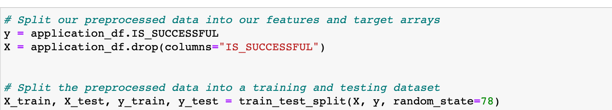
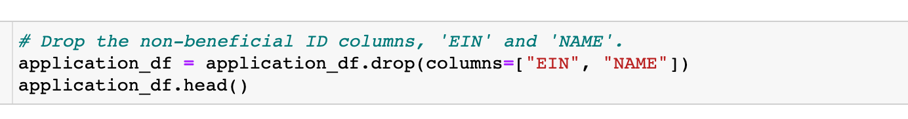
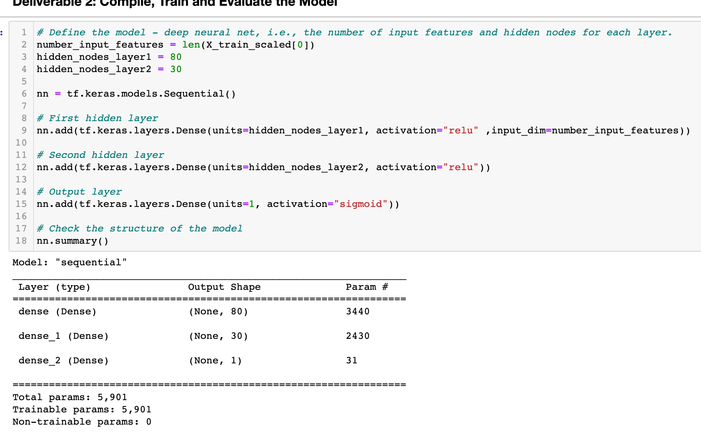
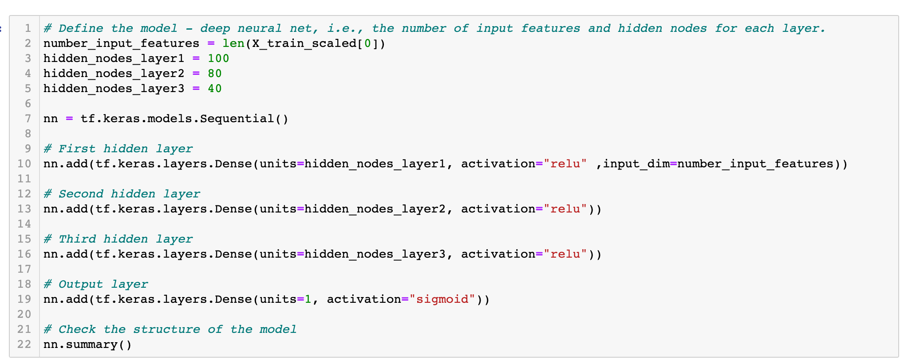

# Neural_Network_Charity_Analysis

## Overview of the analysis

Using machine learning algorithms and neural networks creating a binary classifier that is capable of predicting whether applicants will be successful if funded by Alphabet Soup. Our goal is to have a model that has at least a 75% accuracy.

## Results

### Data Preprocessing
1.	The variable considered the target of my model is IS_SUCCESSFUL.

2.	The variables that are considered the features of my model are APPLICATION_TYPE, AFFILIATION, CLASSIFICATION, USE_CASE, ORGANIZATION, INCOME_AMT, SPECIAL_CONSIDERATIONS, and ASK_AMT.

3.	The variables that are neither target nor features and were removed from the input data are EIN and NAME.

4.	After binning APPLICATION_TYPE and CLASSIFICATION, I binned ASK_AMOUNT as it had a significant amount of unique values in the column.

o	Compiling, Training, and Evaluating the Model

Model 1 : 2 layers with 80 and 30 neorons with ‘Relu’ activation and output layer with ‘Sigmoid’ activation are used. 
Unfortunately Model 1 was not able to achieve the target model performance.

o To increase model performance: First, I worked with the dataset, then added neurons and layers to the model.
Option 1: Dropped ‘ASK_AMT’ column with Model one, accuracy did not change. 
Option 2: Binned ‘ASK_AMT’ with Model one, accuracy was the same. 
Option 3: Added hidden layer and increased neurons along with new binned ‘ASK_AMT’ dataset, unfortunately, accuracy was still the same. 

## Summary: 
Model was not able to achieve the target model performance of 75% accuracy. Even, after several optimization attempt model performance did not improve. 
Random Forest Classifier might be a better fit to achieve the target performance due to its ability.

